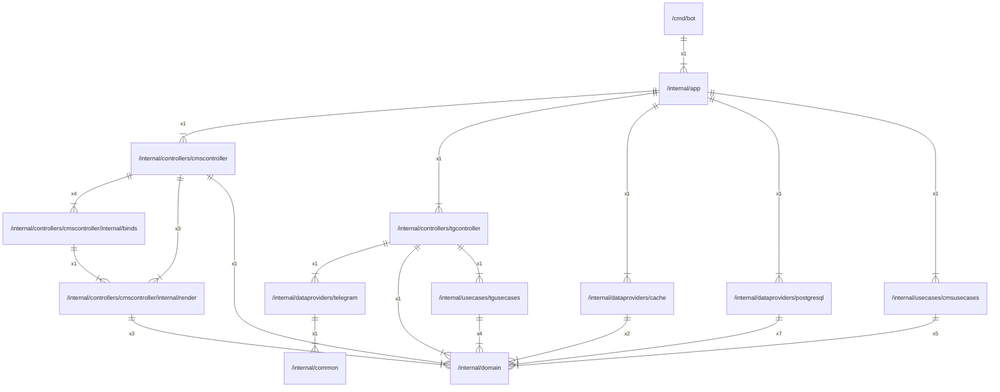

# app

## Main packages

| Name |          Path          |
|:----:|:----------------------:|
| bot  | [/cmd/bot](cmd/bot.md) |

## Inner packages

|     Name      |                                                     Path                                                     |
|:-------------:|:------------------------------------------------------------------------------------------------------------:|
|      bot      |                                            [/cmd/bot](cmd/bot.md)                                            |
|      app      |                                       [/internal/app](internal/app.md)                                       |
|    common     |                                    [/internal/common](internal/common.md)                                    |
| cmscontroller |                 [/internal/controllers/cmscontroller](internal/controllers/cmscontroller.md)                 |
|     binds     |  [/internal/controllers/cmscontroller/internal/binds](internal/controllers/cmscontroller/internal/binds.md)  |
|    render     | [/internal/controllers/cmscontroller/internal/render](internal/controllers/cmscontroller/internal/render.md) |
| tgcontroller  |                  [/internal/controllers/tgcontroller](internal/controllers/tgcontroller.md)                  |
|     cache     |                       [/internal/dataproviders/cache](internal/dataproviders/cache.md)                       |
|  postgresql   |                  [/internal/dataproviders/postgresql](internal/dataproviders/postgresql.md)                  |
|   telegram    |                    [/internal/dataproviders/telegram](internal/dataproviders/telegram.md)                    |
|    domain     |                                    [/internal/domain](internal/domain.md)                                    |
|  cmsusecases  |                      [/internal/usecases/cmsusecases](internal/usecases/cmsusecases.md)                      |
|  tgusecases   |                       [/internal/usecases/tgusecases](internal/usecases/tgusecases.md)                       |

## External imports

|    Name    |                          Path                           | Count |
|:----------:|:-------------------------------------------------------:|:-----:|
|  context   |                         context                         |  34   |
|    fmt     |                           fmt                           |  24   |
|    bot     |               github.com/go-telegram/bot                |  13   |
|   models   |            github.com/go-telegram/bot/models            |  13   |
|    slog    |                        log/slog                         |  11   |
|    time    |                          time                           |  11   |
|   errors   |                         errors                          |   8   |
|     v4     |               github.com/labstack/echo/v4               |   6   |
|  strings   |                         strings                         |   6   |
|  squirrel  |             github.com/Masterminds/squirrel             |   5   |
|    rand    |                        math/rand                        |   5   |
|    http    |                        net/http                         |   5   |
|     io     |                           io                            |   4   |
|    sql     |                      database/sql                       |   3   |
|    sync    |                          sync                           |   3   |
|    json    |                      encoding/json                      |   2   |
| middleware |         github.com/labstack/echo/v4/middleware          |   2   |
|     os     |                           os                            |   2   |
|   bytes    |                          bytes                          |   1   |
|   embed    |                          embed                          |   1   |
|     v5     |                 github.com/jackc/pgx/v5                 |   1   |
|   pgtype   |             github.com/jackc/pgx/v5/pgtype              |   1   |
|  pgxpool   |             github.com/jackc/pgx/v5/pgxpool             |   1   |
|   stdlib   |             github.com/jackc/pgx/v5/stdlib              |   1   |
|    sqlx    |                 github.com/jmoiron/sqlx                 |   1   |
|     v3     |               github.com/pressly/goose/v3               |   1   |
| prometheus |     github.com/prometheus/client_golang/prometheus      |   1   |
|  promauto  | github.com/prometheus/client_golang/prometheus/promauto |   1   |
|  promhttp  | github.com/prometheus/client_golang/prometheus/promhttp |   1   |
| envconfig  |             github.com/vrischmann/envconfig             |   1   |
|   signal   |                        os/signal                        |   1   |
|  strconv   |                         strconv                         |   1   |
|  syscall   |                         syscall                         |   1   |

## Scheme

---

> Generated by [goArchLint](https://github.com/gbh007/goarchlint)
