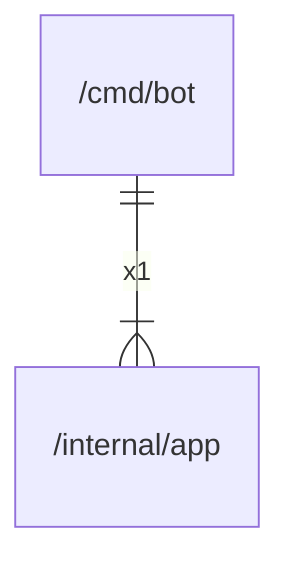

# main

## Imports

|  Name   |                Path                 | Inner | Count |
|:-------:|:-----------------------------------:|:-----:|:-----:|
|   app   | [/internal/app](../internal/app.md) |  ✅   |   1   |
| context |               context               |  ❌   |   1   |
|  slog   |              log/slog               |  ❌   |   1   |
|   os    |                 os                  |  ❌   |   1   |
| signal  |              os/signal              |  ❌   |   1   |
| syscall |               syscall               |  ❌   |   1   |

## Scheme

---

> Generated by [goArchLint](https://github.com/gbh007/goarchlint)
