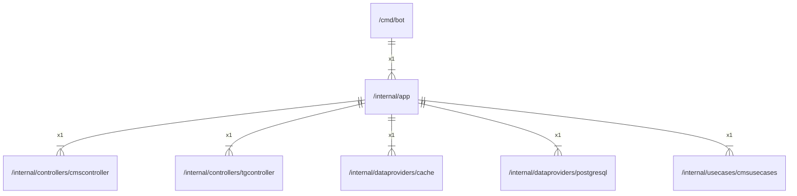

# app

## Imports

|     Name      |                                Path                                 | Inner | Count |
|:-------------:|:-------------------------------------------------------------------:|:-----:|:-----:|
| cmscontroller | [/internal/controllers/cmscontroller](controllers/cmscontroller.md) |  ✅   |   1   |
| tgcontroller  |  [/internal/controllers/tgcontroller](controllers/tgcontroller.md)  |  ✅   |   1   |
|     cache     |       [/internal/dataproviders/cache](dataproviders/cache.md)       |  ✅   |   1   |
|  postgresql   |  [/internal/dataproviders/postgresql](dataproviders/postgresql.md)  |  ✅   |   1   |
|  cmsusecases  |      [/internal/usecases/cmsusecases](usecases/cmsusecases.md)      |  ✅   |   1   |
|    context    |                               context                               |  ❌   |   1   |
|      fmt      |                                 fmt                                 |  ❌   |   1   |
|   envconfig   |                   github.com/vrischmann/envconfig                   |  ❌   |   1   |
|     slog      |                              log/slog                               |  ❌   |   1   |
|      os       |                                 os                                  |  ❌   |   1   |

## Used by

| Name |           Path            |
|:----:|:-------------------------:|
| bot  | [/cmd/bot](../cmd/bot.md) |

## Scheme

---

> Generated by [goArchLint](https://github.com/gbh007/goarchlint)
