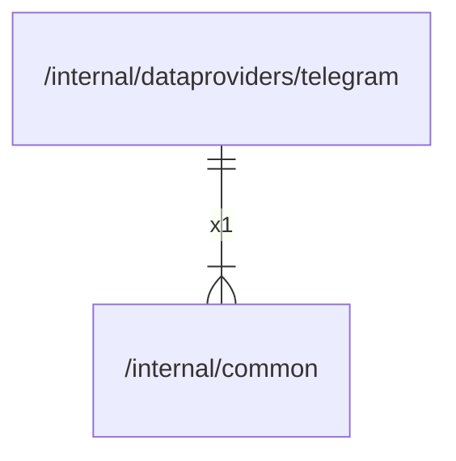

# common

## Imports

|    Name    |                          Path                           | Inner | Count |
|:----------:|:-------------------------------------------------------:|:-----:|:-----:|
| prometheus |     github.com/prometheus/client_golang/prometheus      |  ❌   |   1   |
|  promauto  | github.com/prometheus/client_golang/prometheus/promauto |  ❌   |   1   |

## Used by

|   Name   |                             Path                              |
|:--------:|:-------------------------------------------------------------:|
| telegram | [/internal/dataproviders/telegram](dataproviders/telegram.md) |

## Scheme

---

> Generated by [goArchLint](https://github.com/gbh007/goarchlint)
