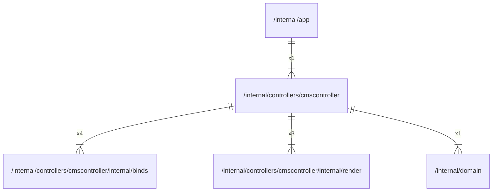

# cmscontroller

## Imports

|    Name    |                                          Path                                           | Inner | Count |
|:----------:|:---------------------------------------------------------------------------------------:|:-----:|:-----:|
|     v4     |                               github.com/labstack/echo/v4                               |  ❌   |   6   |
|    http    |                                        net/http                                         |  ❌   |   5   |
|   binds    |  [/internal/controllers/cmscontroller/internal/binds](cmscontroller/internal/binds.md)  |  ✅   |   4   |
|   render   | [/internal/controllers/cmscontroller/internal/render](cmscontroller/internal/render.md) |  ✅   |   3   |
| middleware |                         github.com/labstack/echo/v4/middleware                          |  ❌   |   2   |
|     io     |                                           io                                            |  ❌   |   2   |
|   domain   |                            [/internal/domain](../domain.md)                             |  ✅   |   1   |
|  context   |                                         context                                         |  ❌   |   1   |
|    json    |                                      encoding/json                                      |  ❌   |   1   |
|   errors   |                                         errors                                          |  ❌   |   1   |
|    fmt     |                                           fmt                                           |  ❌   |   1   |
|  promhttp  |                 github.com/prometheus/client_golang/prometheus/promhttp                 |  ❌   |   1   |
|  strconv   |                                         strconv                                         |  ❌   |   1   |

## Used by

| Name |            Path            |
|:----:|:--------------------------:|
| app  | [/internal/app](../app.md) |

## Scheme

---

> Generated by [goArchLint](https://github.com/gbh007/goarchlint)
