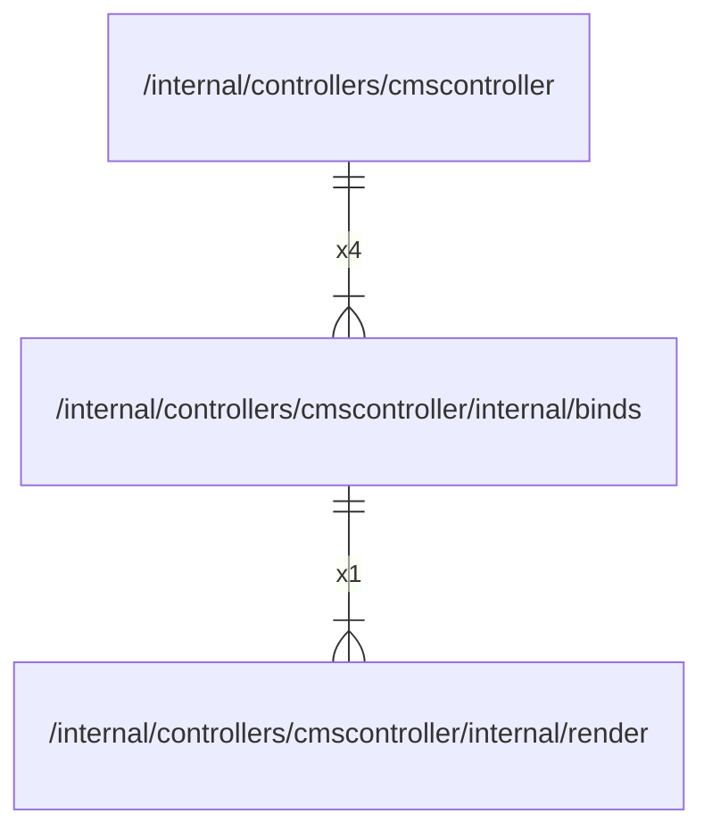

# binds

## Imports

|  Name  |                               Path                               | Inner | Count |
|:------:|:----------------------------------------------------------------:|:-----:|:-----:|
|  fmt   |                               fmt                                |  ❌   |   3   |
| render | [/internal/controllers/cmscontroller/internal/render](render.md) |  ✅   |   1   |
| errors |                              errors                              |  ❌   |   1   |

## Used by

|     Name      |                             Path                              |
|:-------------:|:-------------------------------------------------------------:|
| cmscontroller | [/internal/controllers/cmscontroller](../../cmscontroller.md) |

## Scheme

---

> Generated by [goArchLint](https://github.com/gbh007/goarchlint)
