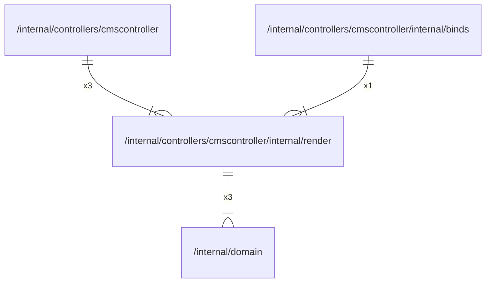

# render

## Imports

|  Name  |                  Path                  | Inner | Count |
|:------:|:--------------------------------------:|:-----:|:-----:|
| domain | [/internal/domain](../../../domain.md) |  ✅   |   3   |
|  time  |                  time                  |  ❌   |   3   |

## Used by

|     Name      |                              Path                              |
|:-------------:|:--------------------------------------------------------------:|
| cmscontroller | [/internal/controllers/cmscontroller](../../cmscontroller.md)  |
|     binds     | [/internal/controllers/cmscontroller/internal/binds](binds.md) |

## Scheme

---

> Generated by [goArchLint](https://github.com/gbh007/goarchlint)
