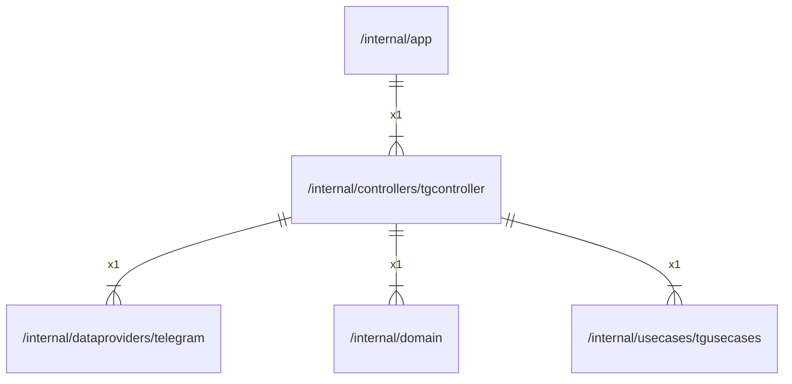

# tgcontroller

## Imports

|    Name    |                               Path                               | Inner | Count |
|:----------:|:----------------------------------------------------------------:|:-----:|:-----:|
|  context   |                             context                              |  ❌   |   2   |
|  telegram  | [/internal/dataproviders/telegram](../dataproviders/telegram.md) |  ✅   |   1   |
|   domain   |                 [/internal/domain](../domain.md)                 |  ✅   |   1   |
| tgusecases |    [/internal/usecases/tgusecases](../usecases/tgusecases.md)    |  ✅   |   1   |
|   errors   |                              errors                              |  ❌   |   1   |
|    fmt     |                               fmt                                |  ❌   |   1   |
|     io     |                                io                                |  ❌   |   1   |
|    slog    |                             log/slog                             |  ❌   |   1   |
|    sync    |                               sync                               |  ❌   |   1   |

## Used by

| Name |            Path            |
|:----:|:--------------------------:|
| app  | [/internal/app](../app.md) |

## Scheme

---

> Generated by [goArchLint](https://github.com/gbh007/goarchlint)
