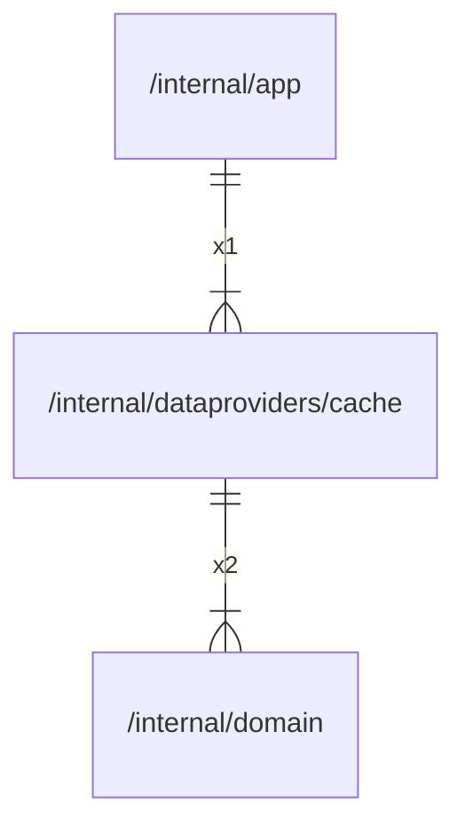

# cache

## Imports

|  Name   |               Path               | Inner | Count |
|:-------:|:--------------------------------:|:-----:|:-----:|
| domain  | [/internal/domain](../domain.md) |  ✅   |   2   |
| context |             context              |  ❌   |   2   |
|  slog   |             log/slog             |  ❌   |   2   |
|  sync   |               sync               |  ❌   |   1   |

## Used by

| Name |            Path            |
|:----:|:--------------------------:|
| app  | [/internal/app](../app.md) |

## Scheme

---

> Generated by [goArchLint](https://github.com/gbh007/goarchlint)
