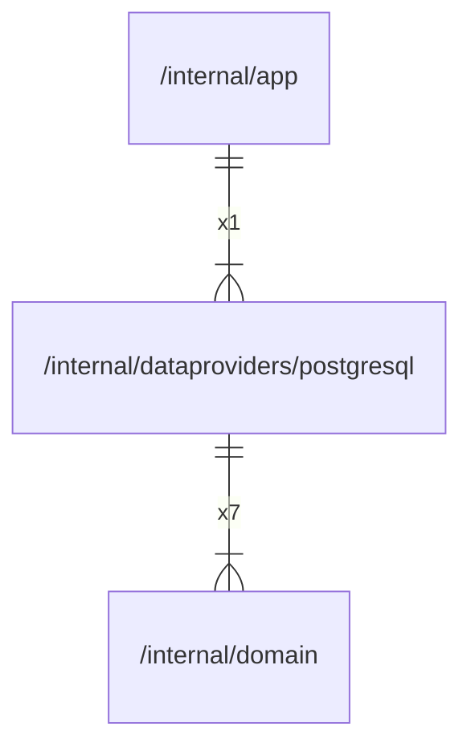

# postgresql

## Imports

|   Name   |               Path               | Inner | Count |
|:--------:|:--------------------------------:|:-----:|:-----:|
| context  |             context              |  ❌   |   8   |
|   fmt    |               fmt                |  ❌   |   8   |
|  domain  | [/internal/domain](../domain.md) |  ✅   |   7   |
| squirrel | github.com/Masterminds/squirrel  |  ❌   |   5   |
|   sql    |           database/sql           |  ❌   |   3   |
|   slog   |             log/slog             |  ❌   |   2   |
|   time   |               time               |  ❌   |   2   |
|  embed   |              embed               |  ❌   |   1   |
|  errors  |              errors              |  ❌   |   1   |
|    v5    |     github.com/jackc/pgx/v5      |  ❌   |   1   |
|  pgtype  |  github.com/jackc/pgx/v5/pgtype  |  ❌   |   1   |
| pgxpool  | github.com/jackc/pgx/v5/pgxpool  |  ❌   |   1   |
|  stdlib  |  github.com/jackc/pgx/v5/stdlib  |  ❌   |   1   |
|   sqlx   |     github.com/jmoiron/sqlx      |  ❌   |   1   |
|    v3    |   github.com/pressly/goose/v3    |  ❌   |   1   |
| strings  |             strings              |  ❌   |   1   |

## Used by

| Name |            Path            |
|:----:|:--------------------------:|
| app  | [/internal/app](../app.md) |

## Scheme

---

> Generated by [goArchLint](https://github.com/gbh007/goarchlint)
