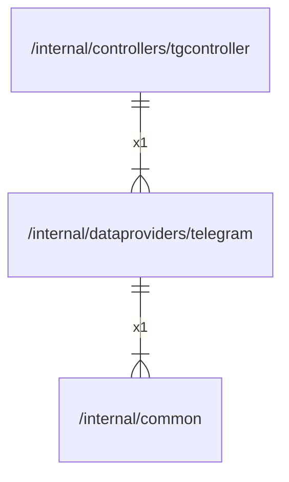

# telegram

## Imports

|  Name   |               Path                | Inner | Count |
|:-------:|:---------------------------------:|:-----:|:-----:|
| context |              context              |  ❌   |   5   |
|   bot   |    github.com/go-telegram/bot     |  ❌   |   5   |
| models  | github.com/go-telegram/bot/models |  ❌   |   5   |
|   fmt   |                fmt                |  ❌   |   2   |
|  slog   |             log/slog              |  ❌   |   2   |
| common  | [/internal/common](../common.md)  |  ✅   |   1   |
|  json   |           encoding/json           |  ❌   |   1   |
|   io    |                io                 |  ❌   |   1   |
|  sync   |               sync                |  ❌   |   1   |

## Used by

|     Name     |                                 Path                                 |
|:------------:|:--------------------------------------------------------------------:|
| tgcontroller | [/internal/controllers/tgcontroller](../controllers/tgcontroller.md) |

## Scheme

---

> Generated by [goArchLint](https://github.com/gbh007/goarchlint)
