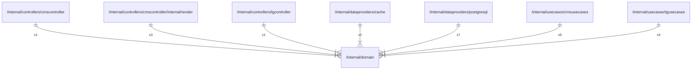

# domain

## Imports

|  Name  |   Path    | Inner | Count |
|:------:|:---------:|:-----:|:-----:|
|  time  |   time    |  ❌   |   5   |
| errors |  errors   |  ❌   |   1   |
|  rand  | math/rand |  ❌   |   1   |

## Used by

|     Name      |                                                Path                                                 |
|:-------------:|:---------------------------------------------------------------------------------------------------:|
| cmscontroller |                 [/internal/controllers/cmscontroller](controllers/cmscontroller.md)                 |
|    render     | [/internal/controllers/cmscontroller/internal/render](controllers/cmscontroller/internal/render.md) |
| tgcontroller  |                  [/internal/controllers/tgcontroller](controllers/tgcontroller.md)                  |
|     cache     |                       [/internal/dataproviders/cache](dataproviders/cache.md)                       |
|  postgresql   |                  [/internal/dataproviders/postgresql](dataproviders/postgresql.md)                  |
|  cmsusecases  |                      [/internal/usecases/cmsusecases](usecases/cmsusecases.md)                      |
|  tgusecases   |                       [/internal/usecases/tgusecases](usecases/tgusecases.md)                       |

## Scheme

---

> Generated by [goArchLint](https://github.com/gbh007/goarchlint)
