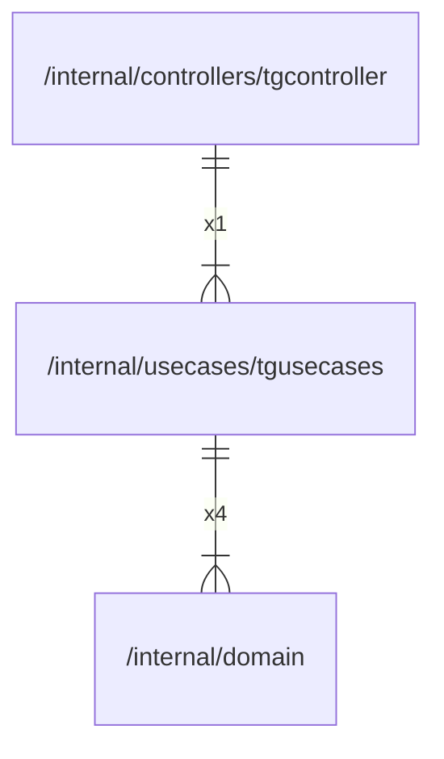

# tgusecases

## Imports

|  Name   |               Path                | Inner | Count |
|:-------:|:---------------------------------:|:-----:|:-----:|
| context |              context              |  ❌   |   9   |
|   bot   |    github.com/go-telegram/bot     |  ❌   |   8   |
| models  | github.com/go-telegram/bot/models |  ❌   |   8   |
|   fmt   |                fmt                |  ❌   |   7   |
| strings |              strings              |  ❌   |   5   |
| domain  | [/internal/domain](../domain.md)  |  ✅   |   4   |
|  rand   |             math/rand             |  ❌   |   4   |
| errors  |              errors               |  ❌   |   3   |
|  slog   |             log/slog              |  ❌   |   2   |
|  bytes  |               bytes               |  ❌   |   1   |

## Used by

|     Name     |                                 Path                                 |
|:------------:|:--------------------------------------------------------------------:|
| tgcontroller | [/internal/controllers/tgcontroller](../controllers/tgcontroller.md) |

## Scheme

---

> Generated by [goArchLint](https://github.com/gbh007/goarchlint)
